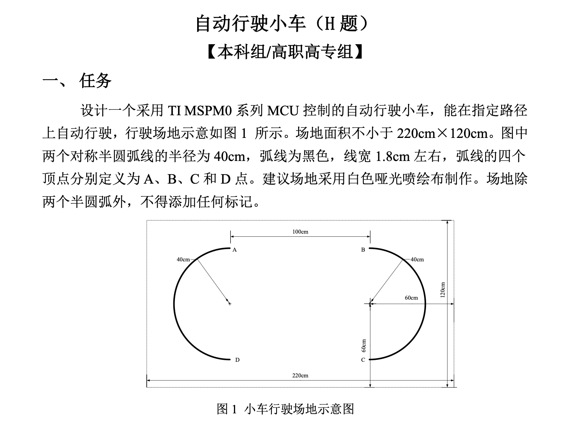
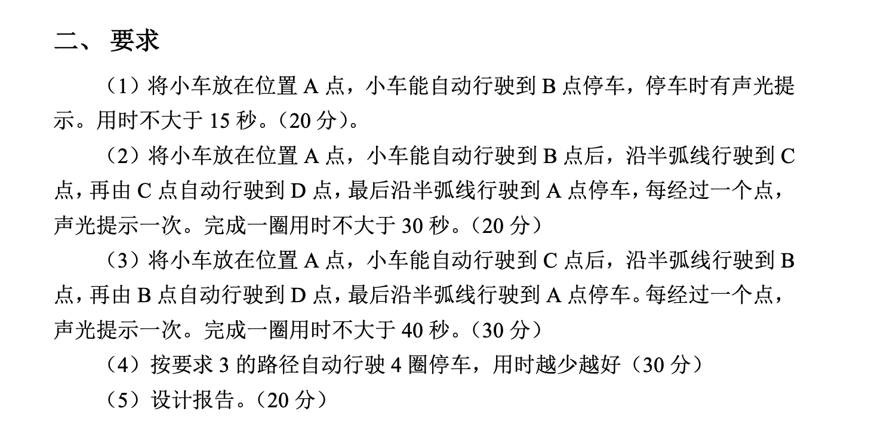

# [24电赛H题] 自动行驶小车，完整代码，即连即用！

## 🎯 项目介绍
本项目基于 TI SMPG03507 控制主板，结合灰度传感器和陀螺仪，通过 PID 算法动态调节左右轮电机转速，实现黑线循迹与控制。小车可识别黑线并进行稳定跟踪，并完成24年电赛H题
---
## 📊题目介绍

## 📺 循迹视频
[bilibili](https://www.bilibili.com/video/BV1ptM3zGEmb)

📮[choucisan@gmail.com]
